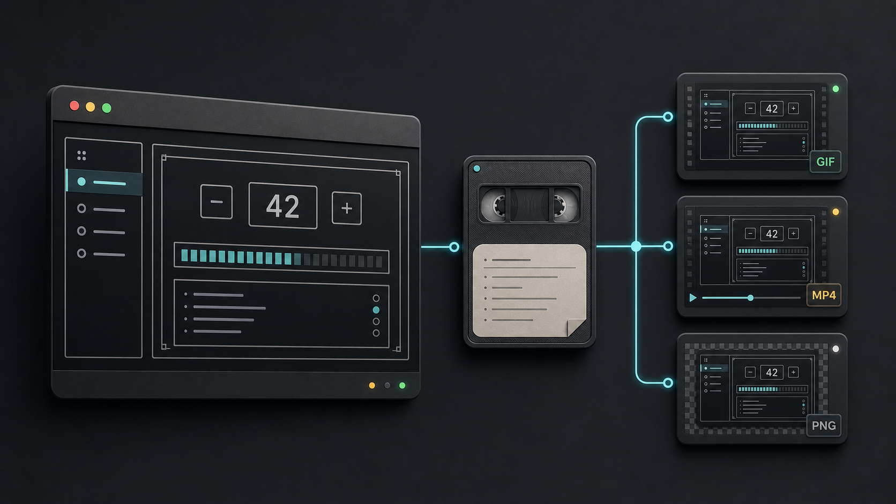
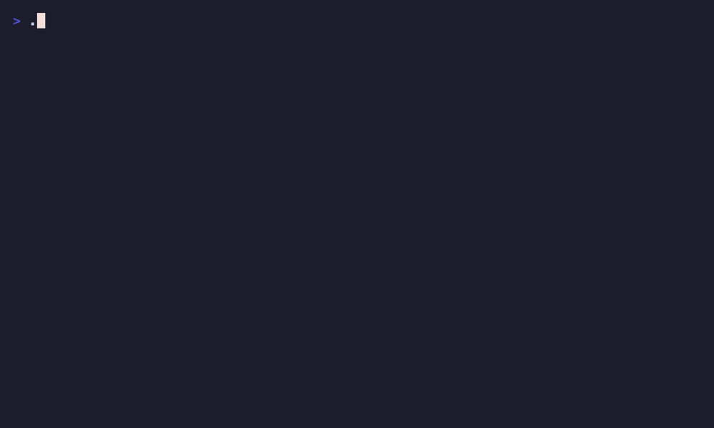
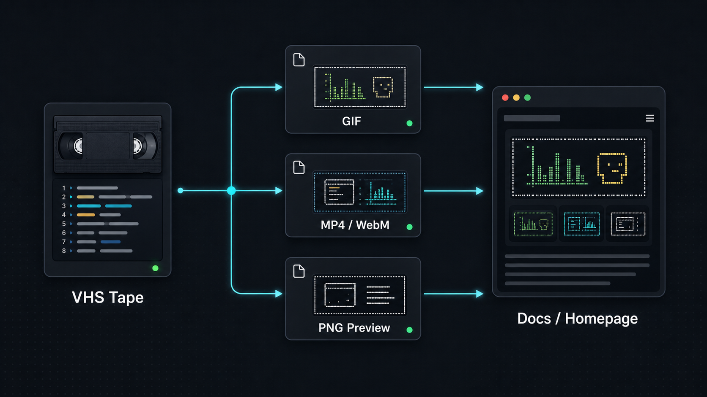
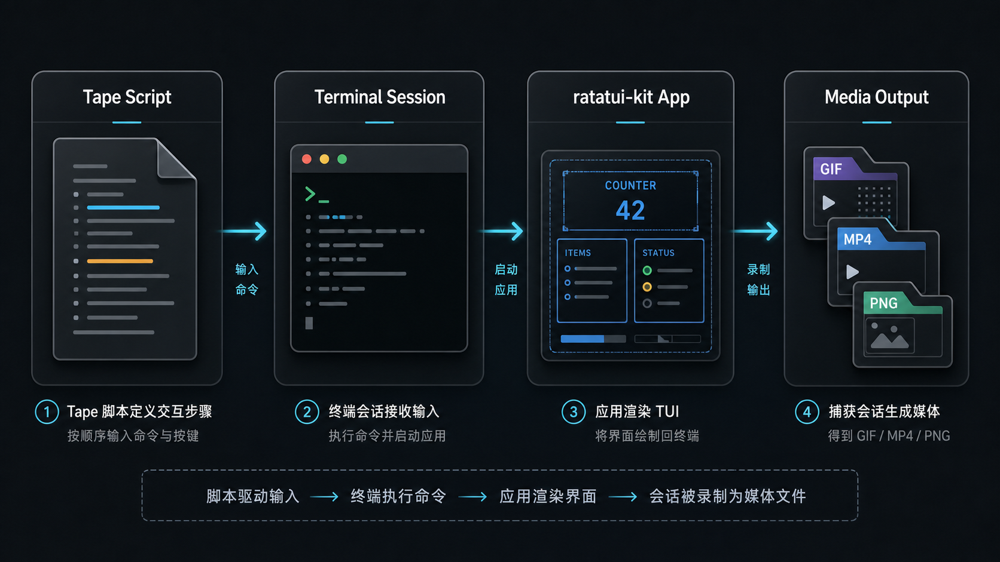
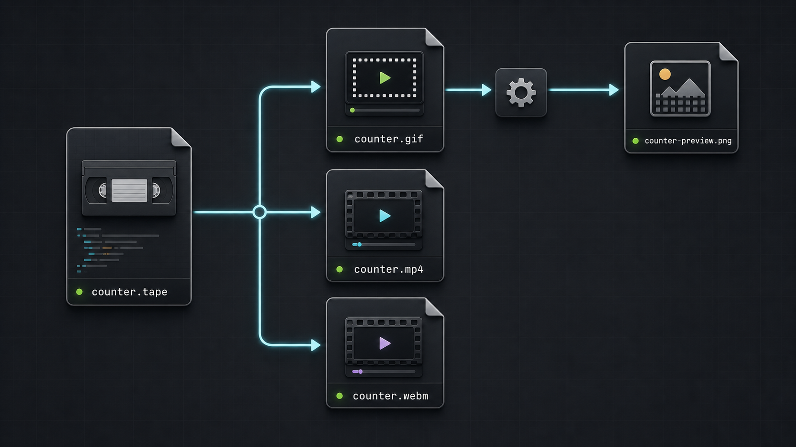
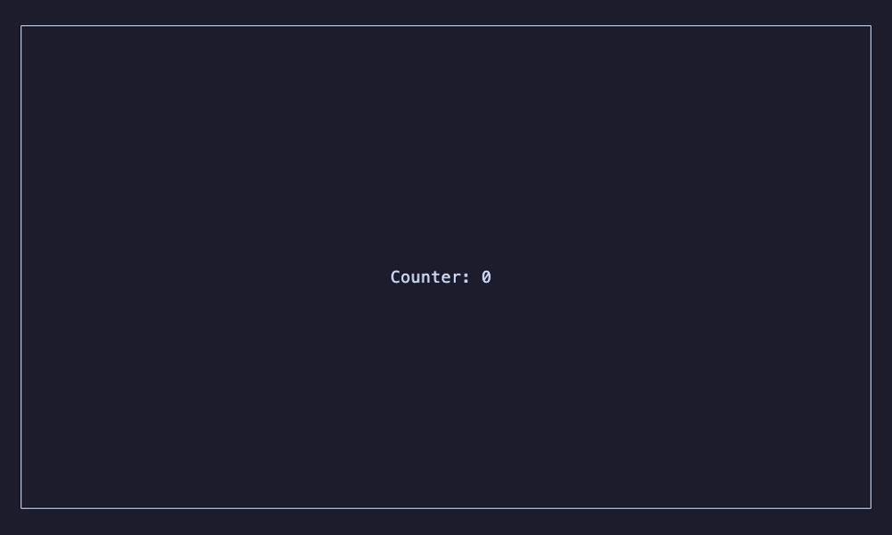
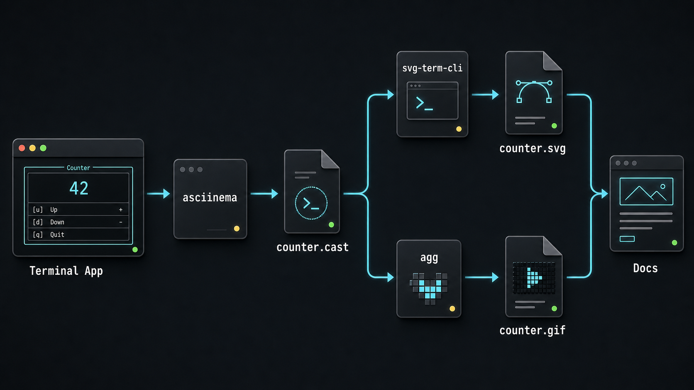
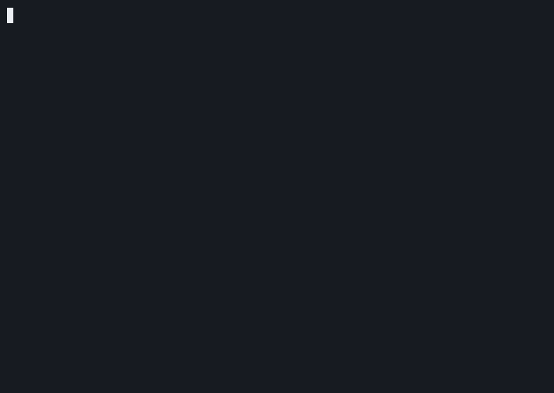

# 别再手动录屏了：用 VHS 给终端应用生成会动的文档素材

最近在整理一个终端 UI 框架的文档时，我遇到一个很现实的问题：

> 终端应用明明是“动起来”才好看，但写到文档里，经常只剩下一段代码和一张截图。

如果只是发到群里看看，系统录屏当然最快。但一旦你想把这些素材放进 README、教程、官网首页，手动录屏就开始变得痛苦：窗口尺寸不统一、终端主题不统一、每次改 UI 都要重录、剪视频、压 GIF、改路径。

后来我把这件事换了一个思路：**不要把录屏当成临时操作，而是把它当成一个可以重复生成的工程产物。**

这篇文章就分享这套做法。主角是 [VHS](https://github.com/charmbracelet/vhs)：一个可以用脚本录制终端并输出 GIF / MP4 / WebM 的工具。



## 先看效果

下面这张 GIF 不是 mock，也不是我手动截出来的图，而是用一份 `.tape` 脚本录制真实终端程序得到的结果：



这个例子来自一个 ratatui 终端 UI 程序。它每秒更新一次计数器，看起来很简单，但刚好能说明一件事：

> 对 TUI 来说，动态演示本身就是文档的一部分。

有了 VHS，我们可以把一次演示固定成下面这条链路：



一份录制脚本可以稳定生成：

- GIF：放 README、掘金文章、文档页。
- MP4 / WebM：放官网首页、hero 区域、社交媒体。
- PNG Preview：从 GIF 或视频里抽一帧，当静态截图用。

## 为什么我不想继续手动录屏

一开始我也是用系统录屏工具解决问题的。录一次、剪一下、导出 GIF，看起来没什么问题。

但文档素材和聊天截图不一样。文档素材是会被长期维护的。

| 文档素材需要什么 | 手动录屏的问题 |
|---|---|
| 尺寸固定 | 每次窗口大小都可能不一样 |
| 主题一致 | 字体、配色、padding 容易漂 |
| 可重复生成 | UI 一改就要重新手动录 |
| 可以自动化 | 很难交给脚本重复执行 |
| 可以追溯 | 不知道某张图到底来自哪个命令 |

所以这里真正的问题不是“怎么录屏”，而是：

> 能不能让终端演示像构建产物一样可重复生成？

VHS 的答案是：可以。把录制过程写成脚本。

## VHS 是什么

VHS 的核心是一种 `.tape` 文件。

你可以把它理解成“写给终端的分镜脚本”。它描述：

- 终端窗口多大。
- 使用什么主题和字体大小。
- 输入什么命令。
- 等待多久。
- 什么时候按 `Ctrl+C`。
- 最后导出成什么格式。

它的工作方式大概是这样：



这和普通录屏最大的区别在于：**录制过程变成了文本文件。**

文本文件意味着它可以被版本管理，可以被复用，可以被 AI 修改，也可以在你改完 UI 后重新跑一遍。

## 安装工具

macOS 上可以这样装：

```bash
brew install vhs
```

VHS 会安装一些录制相关依赖。如果你后面还想把 GIF 抽成静态图，可以确认一下 `ffmpeg` 是否可用：

```bash
vhs --version
ffmpeg -version | head -n 1
```

我本机测试时用到的版本是：

```text
vhs 0.11.0
ffmpeg 8.1.1
```

这篇文章主线只需要 `vhs + ffmpeg`。后面会提到 `asciinema`，但它是备用路线，不是入门必需品。

## 准备一个真实的终端程序

这里用一个最小的 counter example 举例。它启动后会在终端中间显示一个不断增加的数字。

录制前建议先构建二进制：

```bash
cargo build --example counter
```

为什么不直接在 VHS 里跑 `cargo run --example counter`？

因为录制出来的素材应该展示应用本身，而不是编译日志。先 build 一次，再录制编译后的二进制，画面会干净很多：

```text
./target/debug/examples/counter
```

## 写第一份 tape

下面是一份可以工作的 `counter.tape`：

```text
Output docs/public/recordings/counter.gif

Require ./target/debug/examples/counter

Set Shell "bash"
Set FontSize 18
Set Width 1000
Set Height 600
Set Theme "Catppuccin Mocha"
Set Padding 18
Set Framerate 24

Type "./target/debug/examples/counter"
Enter
Sleep 4s
Ctrl+C
Sleep 700ms
```

这份脚本做了几件事：

| 配置 | 作用 |
|---|---|
| `Output` | 指定输出文件 |
| `Require` | 检查二进制是否存在 |
| `Set Width / Height` | 固定录制尺寸 |
| `Set FontSize` | 固定字体大小 |
| `Set Theme` | 固定终端主题 |
| `Type` + `Enter` | 输入启动命令 |
| `Sleep 4s` | 留出动态演示时间 |
| `Ctrl+C` | 退出 full-screen TUI |

然后运行：

```bash
vhs docs/tapes/counter.tape
```

到这里，一张可重复生成的 GIF 就出来了。

## 一份 tape 可以生成多种素材

VHS 不只能输出 GIF。你可以在同一份 tape 里写多个 `Output`：

```text
Output docs/public/recordings/counter.gif
Output docs/public/recordings/counter.mp4
Output docs/public/recordings/counter.webm
```

如果你还需要静态截图，可以从 GIF 或视频里抽一帧：

```bash
ffmpeg \
  -y \
  -ss 2 \
  -i docs/public/recordings/counter.gif \
  -frames:v 1 \
  -update 1 \
  docs/public/recordings/counter-preview.png
```

最终的素材关系可以组织成这样：



抽出来的 preview 大概是这样：



这里我特意抽第 2 秒，而不是第一帧。

很多 full-screen TUI 会先切到 alternate screen。第一帧可能还没完成绘制，看起来像空白终端。抽中间帧更稳。

## 进阶：如果你需要 SVG 或可交互播放

如果你只是想要 GIF、MP4、WebM 或截图，VHS 基本够了。

但有些场景会更进一步，比如：

- 想把终端过程转成 SVG，放在网页里保持清晰。
- 想保留一个原始录制文件，后面换主题、换尺寸重新渲染。
- 想上传到 asciinema.org，得到一个可播放、可暂停、可复制文本的终端回放。

这时可以再看 `asciinema` 这条路线。它会先录出一个 `.cast` 文件，再按需要转换成 SVG 或 GIF。



比如这个 GIF 就是从 asciinema cast 转出来的：



不过我不建议一开始就把 `asciinema + svg-term-cli + agg` 全塞进来。对于多数文档演示，先把 VHS 用顺就够了。等你真的需要 SVG、可交互播放或者原始录制源文件时，再引入这条进阶路线。

## 我的落地建议

如果你也在维护一个终端工具、CLI 框架、TUI 组件库，我建议先选 1-2 个最能代表项目的例子，用 VHS 跑通：

- counter
- router
- store
- modal

然后把最漂亮的 GIF / MP4 放到 README、教程或者官网首页。

重点是：不要一上来把工具链堆满。先让一个例子完整跑通，再复制这条链路。

## 最后

我以前一直把终端录屏当成“发布前手工做一下”的杂活。用 VHS 之后，这件事更像工程资产的一部分：

- 录制脚本可以提交。
- 输出路径可以约定。
- 尺寸和主题可以固定。
- 脚本可以随时复跑。
- 文档里的图片可以随代码更新。

这对终端 UI 项目尤其有价值。

因为很多时候，读者真正想看的不是“这段代码长什么样”，而是：

> 它跑起来的时候，到底是什么感觉？

## 参考链接

- VHS: <https://github.com/charmbracelet/vhs>
- asciinema CLI: <https://docs.asciinema.org/manual/cli/>
- agg: <https://docs.asciinema.org/manual/agg/>
- svg-term-cli: <https://github.com/marionebl/svg-term-cli>
