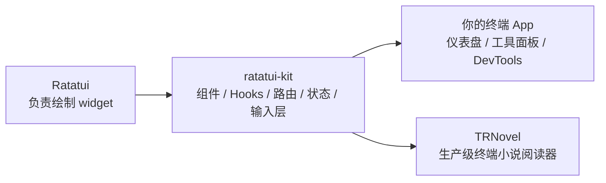
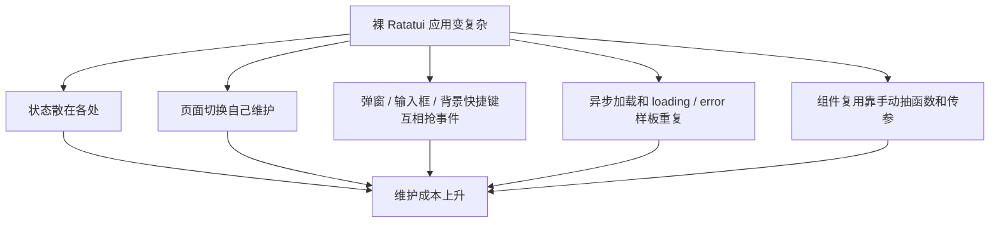
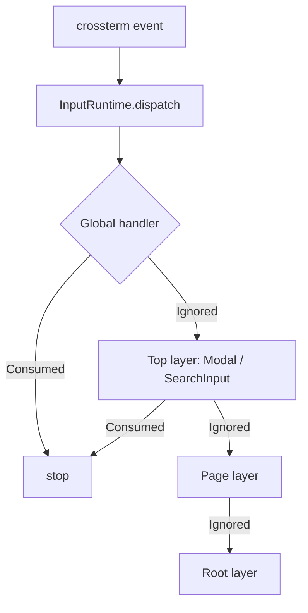
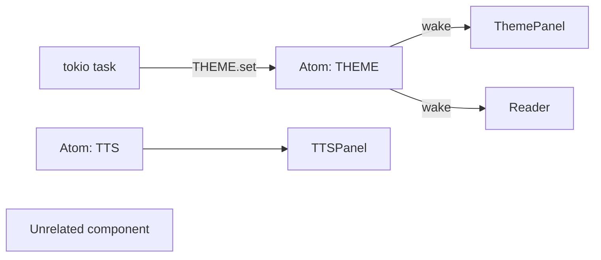
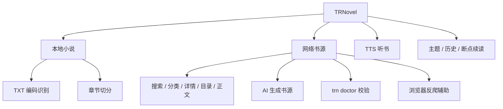
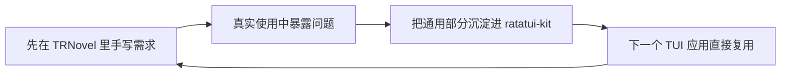

# 想写一个像样的终端 App？试试把 React 的开发体验搬进 Rust TUI


很多人第一次写终端 UI，都会低估它的复杂度。

一开始只是想做个菜单、几个列表、一个搜索框。写着写着就会发现：键盘事件到处飞，弹窗打开后背景还在响应，loading / error / data 三套状态散在页面里，路由和返回逻辑要自己维护，`draw()` 函数越写越像一锅粥。

如果你只是写一个 `ls` / `grep` 这种命令行工具，普通 CLI 足够了。但只要你想做一个真正可交互的终端应用，比如仪表盘、部署面板、数据库浏览器、日志分析器、AI 工具、阅读器，你很快就会碰到一个问题：

> 我需要的已经不是“画几个字符”，而是一套能长期维护的 UI 框架。

这就是 [ratatui-kit](https://github.com/yexiyue/ratatui-kit) 想解决的事。

它不是要替代 [Ratatui](https://github.com/ratatui/ratatui)。Ratatui 负责把终端画出来；ratatui-kit 在它上面补上一层更适合写应用的东西：组件、Props、Hooks、Context、路由、全局状态、输入互斥，以及一套类似 React 的声明式写法。



最近 ratatui-kit 发布了 0.7 / 0.7.1，这不是一次普通小修。它是被一个真实项目逼出来的大升级：我用它做了一个终端小说阅读器 [TRNovel](https://github.com/yexiyue/TRNovel)，在真实交互里踩到的问题，最后都反推回框架里重写。

所以这篇不写“内部实现复盘”，只聊一件事：如果你是新用户，为什么现在值得试试 ratatui-kit。

## ratatui-kit 是什么？

一句话：

> ratatui-kit 是一个 Rust 终端 UI 框架，让你用类似 React 的方式写 Ratatui 应用。

你可以把它理解成：

- `element!` 像 JSX：声明这一帧 UI 长什么样。
- `#[component]` 像函数组件：把一段 UI 拆成可复用组件。
- `use_state` 像 `useState`：组件自己的局部状态。
- `use_future` / `use_async_state`：在组件里直接处理异步加载。
- `ContextProvider` / `use_context`：跨层传依赖。
- `Atom` / `use_atom`：跨页面共享全局状态。
- `RouterProvider` / `routes!`：把复杂 TUI 拆成多个页面。

一个组件大概长这样：

```rust
#[component]
fn Counter(mut hooks: Hooks) -> impl Into<AnyElement<'static>> {
    let mut count = hooks.use_state(|| 0_u64);

    hooks.use_future(async move {
        loop {
            tokio::time::sleep(std::time::Duration::from_secs(1)).await;
            count += 1;
        }
    });

    element!(Text(text: format!("Counter: {}", count.get())))
}
```

没有手写重绘循环。没有到处传 `&mut AppState`。状态变了，组件会唤醒下一帧渲染。

如果你写过 React，这套心智模型基本是熟的；如果你没写过 React，也可以把它当成“更容易拆组件的 Ratatui”。

## 为什么不用裸 Ratatui？

裸 Ratatui 很强，尤其适合你想完全掌控绘制细节的时候。但当应用开始变大，你会反复处理这些问题：



ratatui-kit 的目标不是让 Ratatui 变“简单玩具”，而是把这些应用级问题收进框架：

| 你常见的痛点 | ratatui-kit 给的能力 |
| --- | --- |
| 页面越来越多 | `routes!` + `RouterProvider` |
| 状态传来传去 | `use_state` / `Context` / `Atom` |
| 异步请求样板多 | `use_future` / `use_async_state` |
| 弹窗打开后背景还响应 | 输入层 + `EventResult::Consumed` |
| 列表、搜索框、弹窗重复造 | 内置组件 |
| 想把 UI 拆小 | `#[component]` + `element!` |

这也是为什么 ratatui-kit 适合做“应用”，而不只是做“终端绘图”。

## 0.7 大升级，对新用户意味着什么？

0.7 里面有不少 breaking change，但如果你是新用户，反而是好事：你从一开始拿到的就是更顺手的新 API。

### 1. `element!` 更像真正的声明式 UI

以前写条件渲染、列表渲染会比较别扭。0.7 之后，`element!` 里可以直接写 Rust 控制流：

```rust
element!(View {
    if loading.get() {
        Text(text: "加载中...")
    } else {
        Text(text: "加载完成")
    }

    for (i, item) in items.iter().enumerate() {
        Text(text: item.title.clone(), key: i)
    }
})
```

对新用户来说，这个变化很重要：你不用先学一堆框架自己的特殊符号，直接写 `if` / `for` / `match` 就行。

桥接 Ratatui 原生 widget 也更直白：

```rust
element!(View {
    widget(ratatui_widget)
    stateful(list_widget, list_state)
})
```

### 2. 输入不再靠“全局 bool”硬挡

复杂 TUI 最容易烦人的问题之一，是快捷键冲突。

比如一个页面里有列表和搜索框：搜索框按 Enter 是“提交搜索”，列表按 Enter 是“打开当前项”。如果事件是广播模型，两个地方都可能收到同一个 Enter。你最后只能写一堆 `is_inputting`、`modal_open`、`if !focused` 之类的门控。

0.7 把事件系统改成了中央分发：事件可以被消费，弹窗 / 输入框可以开一个更高的输入层，把背景层自然静音。



这句话翻译成用户体验就是：

> 搜索框正在输入时，背景列表不会偷吃按键；弹窗打开时，背景页面不会乱动。

而且常见场景已经封成组件：`SearchInput`、`ConfirmModal`、`AlertModal`、`ShortcutInfoModal` 默认就处理了输入互斥。

### 3. 全局状态从“大 store”变成轻量 Atom

有些状态只属于一个组件，用 `use_state` 就好。

但有些状态是整个应用都关心的，比如主题、登录态、当前连接、后台任务状态。这种状态在 0.7 里可以用 `Atom`：

```rust
static THEME: Atom<ThemeConfig> = Atom::new(ThemeConfig::default);

#[component]
fn ThemePanel(mut hooks: Hooks) -> impl Into<AnyElement<'static>> {
    let theme = hooks.use_atom(&THEME);
    element!(Text(text: format!("current theme: {}", theme.read().name)))
}
```

写入一个 atom，只会唤醒订阅它的组件。对新用户来说，你不需要先设计一整套 store 架构，也能把跨页面状态放到一个清楚的位置。



### 4. 很多组件是从真实项目里长出来的

0.7 不只是把 API 改好看，还把 TRNovel 里反复出现的通用组件沉淀回框架：

- `SearchInput`：搜索框，内部处理编辑态和输入互斥。
- `ConfirmModal` / `AlertModal` / `ShortcutInfoModal`：常见弹窗。
- `Select` / `MultiSelect` / `TreeSelect`：选择器。
- `VirtualList`：长列表。
- `WrappedText`：长文本预换行，适合日志、说明、阅读正文。
- `use_async_state`：异步数据三态，处理 data / loading / error。

这些组件不是为了 demo 凑出来的，而是在 TRNovel 里先被真实使用，再抽回框架。这个顺序很重要：真实应用会暴露 demo 暴露不了的问题。

## TRNovel：一个用 ratatui-kit 写出来的真实产品

如果只看一个计数器示例，你很难判断框架能不能撑住复杂应用。所以我更想推荐你看 TRNovel。


TRNovel 是一个 Rust 写的终端小说阅读器。它不是玩具项目，已经可以通过 cargo、npm、Homebrew 安装，一个二进制开箱即用：

```bash
cargo install trnovel
npm i -g @trnovel/trnovel
brew install yexiyue/tap/trnovel
```

它支持：

- 本地 `.txt` 小说阅读，识别 UTF-8 / GBK，自动切章节。
- 网络书源搜索、详情、目录、正文阅读。
- AI 生成书源：给 agent 一个小说站 URL，生成书源后用 `trn doctor` 校验到可用。
- 浏览器反爬辅助：遇到 Cloudflare 等挑战页，可以用系统浏览器解挑战再回填 cookie。
- Kokoro 中文 TTS 听书，播放进度和正文高亮同步。
- 历史记录、断点续读、主题配置、跨平台安装。



更关键的是，它的 UI 就是 ratatui-kit 写的。

当前 TRNovel 的主程序 UI 大约有：

- 69 个 Rust 源文件，约 8300 行代码。
- 13 个路由页，挂在一个 `routes!` 宏里。
- 34 个 `#[component]` 函数组件。
- 59 处 `element!` 调用。
- 25 处 `use_event_handler`。
- 12 处 `use_atom`。

这些数字不是为了炫规模，而是说明一件事：ratatui-kit 不只是能写 demo，它已经撑过一个真实 TUI 产品的页面拆分、状态共享、弹窗输入、异步加载、跨页面导航和长文本阅读。

TRNovel 里甚至同一个泛型阅读组件会注册成两条路由：

```rust
routes!(
    "/" => Layout {
        "/local-novel" => ReadNovel<LocalNovel>,
        "/network-novel" => ReadNovel<NetworkNovel>,
    }
);
```

这就是框架真正有价值的地方：当你的终端 UI 从“一个页面”长成“一个应用”，你还能继续拆组件、拆页面、复用状态，而不是把所有东西塞进一个巨大的 `match`。

## 为什么 TRNovel 会反过来让 ratatui-kit 更好？

我很喜欢这个循环：



比如：

- TRNovel 里搜索框和背景列表抢 Enter，于是 ratatui-kit 重写了输入层。
- TRNovel 里到处有确认弹窗、提示弹窗、快捷键弹窗，于是框架内置了 Modal 系列。
- TRNovel 阅读正文需要长文本预换行，于是有了 `WrappedText`。
- TRNovel 页面需要共享主题和 TTS 模型，于是全局状态迁成了 Atom。
- TRNovel 的网络页面到处有 data / loading / error，于是沉淀出 `use_async_state`。

这比“我设计了一套 API，大家来试试”更可靠一点。因为顺序反过来了：真实应用先把问题打出来，框架再吸收。

## 谁适合试试 ratatui-kit？

我觉得这些场景很适合：

- 你已经会 Rust，想做一个比普通 CLI 更强的终端工具。
- 你用过 React，希望在 TUI 里也能用组件和 Hooks 的思路。
- 你在写数据库、日志、部署、爬虫、AI agent、监控、阅读器这类交互型工具。
- 你喜欢 Ratatui，但不想每个项目都从事件循环、状态管理、页面切换开始手写。
- 你希望一个终端应用能逐渐长大，而不是三天后变成不可维护的单文件。

当然，如果你的需求只是一个简单命令，比如 `mytool convert a b`，那就没必要上框架。ratatui-kit 更适合“有界面、有状态、有多个页面、有交互”的应用。

## 怎么开始？

安装：

```bash
cargo add ratatui-kit --features full
```

跑示例：

```bash
cargo run --example counter
cargo run --example router
cargo run --example modal
cargo run --example todo_app
```

如果你想直接看一个真实应用：

```bash
cargo install trnovel
trn
```

项目地址：

- ratatui-kit：<https://github.com/yexiyue/ratatui-kit>
- ratatui-kit 文档：<https://yexiyue.github.io/ratatui-kit/>
- TRNovel：<https://github.com/yexiyue/TRNovel>
- TRNovel 文档：<https://yexiyue.github.io/TRNovel/>

如果你正在做 Rust 终端工具，尤其是那种“已经不满足于命令行参数，想要一个真正界面”的工具，可以试试 ratatui-kit。

也欢迎顺手看看 TRNovel。它是 ratatui-kit 的生产级样本，也是新能力最先被验证的地方。star TRNovel，基本就能看到 ratatui-kit 下一批会沉淀什么东西。
